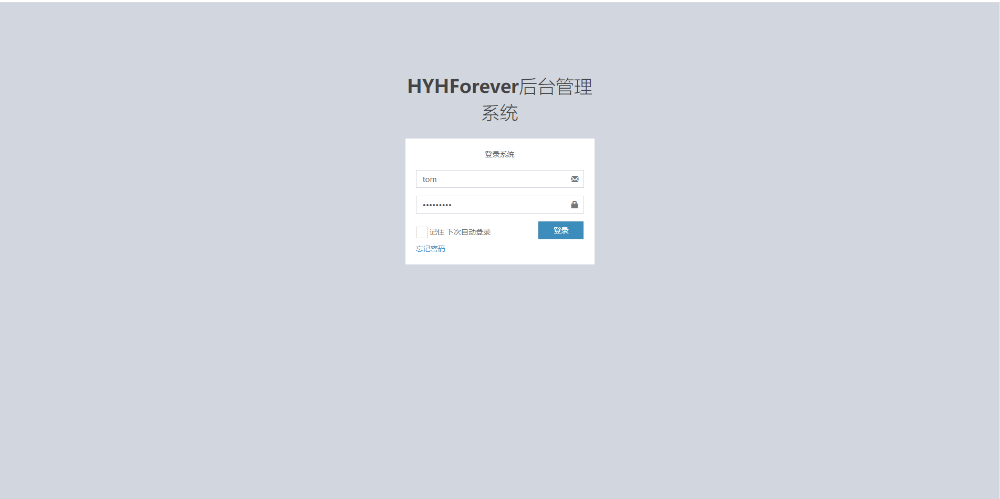

# Readme

### 介绍

​	使用SSM框架搭建的一个简单的企业后台权限管理系统的Demo，大部分功能已经完成，使用SpringSecurity进行权限控制。前端使用AdminTLE组件库完成配置。

​	项目已经完成了大部分的数据处理功能，作为一个Demo，没有完全完善所有的功能。比如：终端控制数据修改、删除；针对不同管理系统角色权限级别的方法级权限控制；针对不同系统身份的页面功能权限控制；

​	但是，上述功能都已经完成了一个小的功能点，可以根据业务需要进行添加和修改。

### 技术选型

1. 前端

   > AdminTLE、JQuery、JSP
   
2. 后端业务

   > - maven、SSM、PageHelper、MYSQL数据库、SpringSecurity

### 项目截图

### 使用说明

1. clone完整的项目代码

2. 在Mysql8.x版本运行项目文件中的`project.sql`文件；如果使用的是Mysql5.x或者其他数据库，需要根据下文的数据库结构自建对应数据库。

3. 修改数据库连接以及配置文件；`EnterpriseRMS_web/src/main/resources/jdbcConfig.properties`文件中修改mysql配置文件。

   > 如果使用的其他数据库，需要修改父模块的pom.xml文件中的数据库依赖，如下图所示
   >
   > 

4. 初次运行，如果没有导入数据库的数据，需要手动在数据库中添加一个用户，建议导入本项目的测试数据方便修改。测试数据放在项目文件中的`data.sql`文件中；

5. 配置运行配置即可运行

   

### 数据库结构

### 项目结构

### 说明

​	作者本身技术水平并不高，此项目适用于SSM框架初学者，无实际工作经验的java小白；查看`readme.md`后仍对项目不了解的，可以查看`开发流程.md`;

